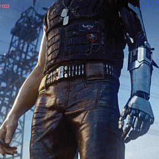

  

# Éwerton

Professor (SENAI/SC) • História, Patrimônio & Tecnologia  
Materiais de aula, exemplos práticos e projetos didáticos.

---

## O que você encontra aqui
- Repositórios para **aulas**: exercícios, templates, checklists, avaliações e projetos guiados.
- Exemplos de **web** (HTML/CSS e frameworks quando fizer sentido).
- Scripts e automações para **dados** (Python/R) aplicados a problemas reais.
- Projetos interdisciplinares: tecnologia, sociedade, sustentabilidade e patrimônio.

## Para meus alunos
- Comece pelos repositórios **fixados (Pinned)** — eles são a trilha principal.
- Cada repo de aula deve ter: **objetivo**, **pré-requisitos**, **passo a passo** e **desafios**.
- Dúvidas: abra uma **Issue** com:
  - o que você tentou,
  - o erro completo,
  - print + trecho do código.

## Pesquisa e temas que atravessam meus projetos
- Patrimônio ambiental e sustentabilidade
- Resíduos eletrônicos (e-waste) e políticas públicas
- Ciclo de vida da tecnologia e impactos socioambientais
- Ferramentas digitais aplicadas às Humanidades

## Tecnologias
**Linguagens:** C, C++, C#, Python, R, PHP  
**Web:** HTML, CSS (e JavaScript quando necessário)  
**Frameworks (uso didático):** React, Angular, Vue  
**Banco de dados:** MySQL, PostgreSQL

  
  
  
  
  
  
  
  

## Contato
- Sala de aula / canal oficial da turma: https://ava.sesisenai.org.br
- LinkedIn: https://www.linkedin.com/in/eocercal/
- ORCID / Lattes: https://orcid.org/0009-0006-8912-908X / http://lattes.cnpq.br/6660845771975564

---

  “Wake the fuck up, Samurai! We have a city to burn.” - Johnny Silverhand

&nbsp;

  

